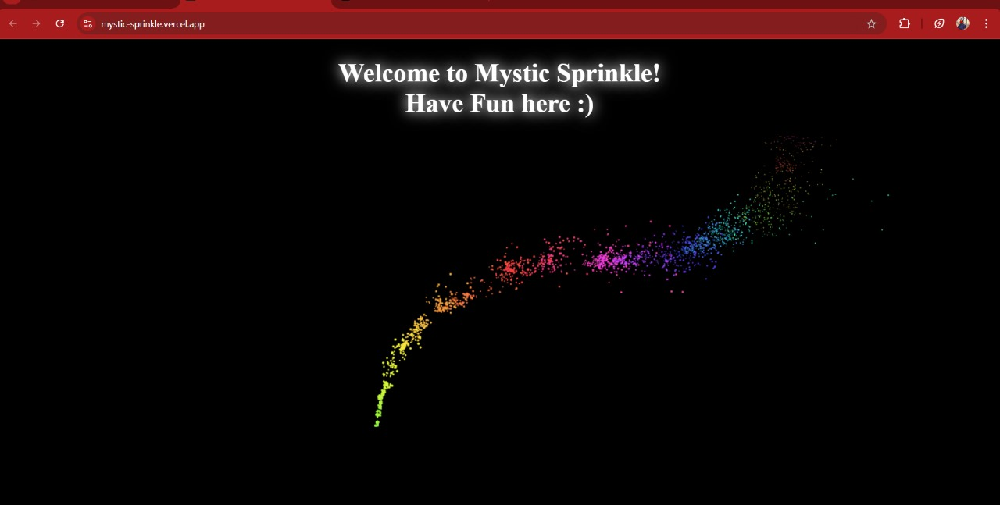

# 🌟 Mystic Sprinkle  
**A captivating React-based web application featuring a dynamic particle trail effect that follows your cursor or touch! Add a sprinkle of magic and fun to your web pages.**  

---

## 🖼️ Demo  
[Live Demo Link](https://mystic-sprinkle.vercel.app/)

---

## 📖 Table of Contents  
- [Features](#-features)  
- [Setup](#-setup)  
- [Usage](#-usage)  
- [Technologies Used](#-technologies-used)  
- [Customization](#-customization)  
- [Screenshots](#-screenshots)  
- [Contributing](#-contributing)  
- [License](#-license)  

---

## ✨ Features  
- Interactive particle effects on **mouse move**, **click**, and **touch gestures**.  
- Beautiful particle animations that glow and follow the pointer.  
- Fully responsive design, ensuring compatibility across devices (laptops, tablets, and mobiles).  
- Easy to integrate with any React project.  

---

## ⚙️ Setup  

### Prerequisites  
Make sure you have Node.js and npm installed.  

### Steps  
1. **Clone the Repository**  
   ```bash  
   git clone https://github.com/nayanatara07/mystic_sprinkle.git  
   cd mystic_sprinkle  
   ```  

2. **Install Dependencies**  
   ```bash  
   npm install  
   ```  

3. **Run the Development Server**  
   ```bash  
   npm start  
   ```  

4. Open [http://localhost:3000](http://localhost:3000) in your browser to view the app.  

---

## 🚀 Usage  
To integrate Mystic Sprinkle into your own React app:  

1. Copy the `PointerParticles` component from the `PointerParticles.js` file into your project.  
2. Import and use it in your `App.js` or any component:  
   ```jsx  
   import PointerParticles from './PointerParticles';  

   function App() {  
     return (  
       <div>  
         <PointerParticles />  
         <h1>Mystic Sprinkle</h1>  
       </div>  
     );  
   }  
   export default App;  
   ```  

---

## 💻 Technologies Used  
- **React.js**: For building the user interface.  
- **JavaScript (ES6)**: For particle animations and DOM manipulation.  
- **HTML5 Canvas**: For rendering the particle effects.  
- **CSS3**: For styling.  

---

## 🎨 Customization  

### Change Particle Colors  
In `PointerParticles.js`, modify the `this.color` property to use your preferred color scheme:  
```javascript  
this.color = `hsl(${hue}deg 90% 60%)`;  
```  

### Adjust Particle Behavior  
- **Particle Count**: Increase or decrease the number of particles by modifying the `count` parameter in the `createParticles` function.  
- **Spread and Speed**: Tweak `spread` and `speed` values for custom effects.  

---

## 🖼️ Screenshots  

### Desktop Experience  
 

### Mobile Experience  
  

---

## 🤝 Contributing  
Contributions are welcome!  
1. Fork the repository.  
2. Create a feature branch.  
   ```bash  
   git checkout -b feature-name  
   ```  
3. Commit your changes.  
   ```bash  
   git commit -m "Add some feature"  
   ```  
4. Push to the branch.  
   ```bash  
   git push origin feature-name  
   ```  
5. Open a pull request.  

---

🌈 **Enjoy the magic of Mystic Sprinkle! Happy coding!** 🌟  

--- 

Feel free to customize this further with your project's specific details!